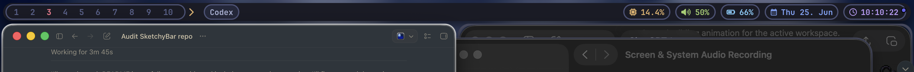

# SketchyBar AeroSpace Configuration

This is a SketchyBar configuration ported from `yabai` space handling to AeroSpace numbered workspaces. It keeps the original compact, capsule-based visual style while using AeroSpace as the source of truth for workspace state.

## Screenshots



## What You Get

- Numbered AeroSpace workspaces in numeric order.
- Clickable workspace items using `aerospace workspace <id>`.
- Focused workspace highlighting.
- Front app, Spotify/media, clock, calendar, battery, volume, and CPU widgets.
- Shared visual tokens for consistent capsule height, padding, borders, fonts, and hover animation.
- Centralized helper scripts for AeroSpace queries and UI behavior.

## Repository Layout

```text
sketchybar
├── items/          # SketchyBar item definitions
├── plugins/        # Event handlers and update scripts
├── helpers/        # Shared UI and AeroSpace helper functions
├── variables.sh    # Shared colors, fonts, dimensions, and paths
├── sketchybarrc    # Main SketchyBar entrypoint
├── README.md
├── AGENTS.md
└── TODO.md
```

## Dependencies

Required:

- macOS
- Homebrew
- SketchyBar
- AeroSpace
- `jq`
- JetBrainsMono Nerd Font

Used by built-in macOS widgets:

- `date` for clock/calendar
- `pmset` for battery
- `osascript` for volume
- `ps` and `awk` for CPU

Optional:

- `borders`, if your AeroSpace config uses it.
- Spotify or any app that emits SketchyBar `media_change` events.

## Installation

These steps assume a fresh setup and should take about 5-10 minutes.

1. Install dependencies:

```sh
brew tap FelixKratz/formulae
brew install sketchybar jq
brew install --cask aerospace
brew install --cask font-jetbrains-mono-nerd-font
```

2. Clone or copy this repository:

```sh
mkdir -p ~/.config
git clone <your-repo-url> ~/.config/sketchybar
```

If you are copying from an existing checkout, place it at:

```text
~/.config/sketchybar
```

3. Ensure scripts are executable:

```sh
chmod +x ~/.config/sketchybar/sketchybarrc
chmod +x ~/.config/sketchybar/items/*.sh
chmod +x ~/.config/sketchybar/plugins/*.sh
chmod +x ~/.config/sketchybar/helpers/*.sh
```

4. Start or reload SketchyBar:

```sh
brew services start sketchybar
sketchybar --reload
```

5. Start AeroSpace:

```sh
open -a AeroSpace
```

6. Verify the basics:

```sh
aerospace list-workspaces --all
aerospace list-workspaces --focused
sketchybar --reload
```

## AeroSpace Integration

This configuration expects numbered AeroSpace workspaces, usually `1` through `10`.

The workspace item list is created from:

```sh
aerospace list-workspaces --all
```

Workspace clicks run:

```sh
aerospace workspace <id>
```

Add this hook to your AeroSpace config, usually `~/.config/aerospace/aerospace.toml` or `~/.aerospace.toml`:

```toml
exec-on-workspace-change = ['/bin/bash', '-c', 'sketchybar --trigger aerospace_workspace_change FOCUSED_WORKSPACE=$AEROSPACE_FOCUSED_WORKSPACE PREV_WORKSPACE=$AEROSPACE_PREV_WORKSPACE']
```

Recommended numbered workspace bindings:

```toml
[mode.main.binding]
alt-1 = 'workspace 1'
alt-2 = 'workspace 2'
alt-3 = 'workspace 3'
alt-4 = 'workspace 4'
alt-5 = 'workspace 5'
alt-6 = 'workspace 6'
alt-7 = 'workspace 7'
alt-8 = 'workspace 8'
alt-9 = 'workspace 9'
alt-0 = 'workspace 10'

alt-shift-1 = 'move-node-to-workspace 1'
alt-shift-2 = 'move-node-to-workspace 2'
alt-shift-3 = 'move-node-to-workspace 3'
alt-shift-4 = 'move-node-to-workspace 4'
alt-shift-5 = 'move-node-to-workspace 5'
alt-shift-6 = 'move-node-to-workspace 6'
alt-shift-7 = 'move-node-to-workspace 7'
alt-shift-8 = 'move-node-to-workspace 8'
alt-shift-9 = 'move-node-to-workspace 9'
alt-shift-0 = 'move-node-to-workspace 10'
```

Reload AeroSpace after editing:

```sh
aerospace reload-config
```

## Font Requirements

The configured font is:

```sh
FONT="JetBrainsMono Nerd Font"
```

Install it with:

```sh
brew install --cask font-jetbrains-mono-nerd-font
```

If icons show as `[?]`, confirm the font is installed and then restart SketchyBar:

```sh
ls ~/Library/Fonts | rg 'JetBrains.*Nerd'
sketchybar --reload
```

Some icons come from Nerd Font / Font Awesome mappings. If a glyph is missing on your machine, replace the icon in the relevant plugin or item file with a glyph from your installed Nerd Font.

## Color Palette

The palette lives in `variables.sh`.

```sh
BAR_COLOR=0xff1a1b26
BLACK=0xff24283b
BLUE=0xff7aa2f7
COMMENT=0xff565f89
CYAN=0xff7dcfff
GREEN=0xff9ece6a
MAGENTA=0xffbb9af7
RED=0xfff7768e
WHITE=0xffa9b1d6
YELLOW=0xffe0af68
```

Workspace colors:

```sh
WORKSPACE_ACTIVE_COLOR=$RED
WORKSPACE_HOVER_COLOR=$YELLOW
WORKSPACE_INACTIVE_COLOR=$COMMENT
```

Widget border color:

```sh
WIDGET_BORDER_COLOR=0xcc565f89
```

## Customization Guide

Visual settings are centralized in `variables.sh`:

```sh
BORDER_WIDTH=2
CAPSULE_HEIGHT=26
CAPSULE_PADDING=10
CORNER_RADIUS=15
PADDINGS=3
WIDGET_SPACING=4
```

To change widget order, edit the right/left/center source order in `sketchybarrc`.

To disable a widget, comment out its source line in `sketchybarrc`. For example:

```sh
# source "$ITEM_DIR/spotify.sh"
```

To change a widget color, edit the `COLOR=...` assignment at the top of the matching file in `items/`.

To change update intervals:

- Clock: `items/clock.sh`
- Calendar: `items/calendar.sh`
- Battery: `items/battery.sh`
- CPU: `items/cpu.sh`

To add shared shell logic, prefer a file in `helpers/` and source it from the plugin that needs it.

## Troubleshooting

### SketchyBar does not start

Run:

```sh
sketchybar --reload
```

If that fails, check executable permissions:

```sh
chmod +x ~/.config/sketchybar/sketchybarrc
chmod +x ~/.config/sketchybar/items/*.sh
chmod +x ~/.config/sketchybar/plugins/*.sh
chmod +x ~/.config/sketchybar/helpers/*.sh
```

### Workspace items do not show

Check AeroSpace:

```sh
open -a AeroSpace
aerospace list-workspaces --all
```

If it prints no numbered workspaces, configure numbered workspaces in AeroSpace first.

### Workspace highlight does not update

Confirm the AeroSpace hook is installed:

```toml
exec-on-workspace-change = ['/bin/bash', '-c', 'sketchybar --trigger aerospace_workspace_change FOCUSED_WORKSPACE=$AEROSPACE_FOCUSED_WORKSPACE PREV_WORKSPACE=$AEROSPACE_PREV_WORKSPACE']
```

Then reload AeroSpace and SketchyBar:

```sh
aerospace reload-config
sketchybar --reload
```

### Clicking a workspace does nothing

Run the click command directly:

```sh
aerospace workspace 1
```

If that fails, AeroSpace is not running or the workspace does not exist.

### Icons render as `[?]`

Install the Nerd Font:

```sh
brew install --cask font-jetbrains-mono-nerd-font
sketchybar --reload
```

If only one icon is broken, replace that glyph in the matching plugin or item script.

### Spotify/media does not appear

The Spotify widget only draws when the `media_change` payload reports Spotify as playing. Test by starting playback, then reload:

```sh
sketchybar --reload
```

Confirm `jq` is installed:

```sh
jq --version
```

### Volume is stuck or shows `0%`

The current volume plugin uses AppleScript through `osascript`. Test the command:

```sh
osascript -e "output volume of (get volume settings)"
osascript -e "output muted of (get volume settings)"
```

If either command fails on your macOS version, update `plugins/sound.sh` to use a supported volume command for your system.

### CPU always shows `0.0%`

The CPU plugin uses `ps`:

```sh
ps -A -o %cpu
```

If macOS privacy or sandbox restrictions block process listing, grant the terminal/app appropriate permissions or replace the CPU plugin with another metrics source.

## Verification Checklist

After installation:

```sh
sh -n ~/.config/sketchybar/items/*.sh ~/.config/sketchybar/plugins/*.sh ~/.config/sketchybar/helpers/*.sh ~/.config/sketchybar/sketchybarrc ~/.config/sketchybar/variables.sh
sketchybar --reload
aerospace list-workspaces --all
aerospace list-workspaces --focused
```

Manual checks:

- Click each workspace in the bar.
- Switch workspaces with AeroSpace keybindings.
- Open and close a window.
- Start and pause Spotify.
- Change volume.
- Unplug or plug in power.

## Known Limitations

- Workspace occupancy indicators are not implemented yet.
- The volume plugin may need a macOS-version-specific command if AppleScript volume access changes.
- AeroSpace must be running for workspace click/focus behavior.
